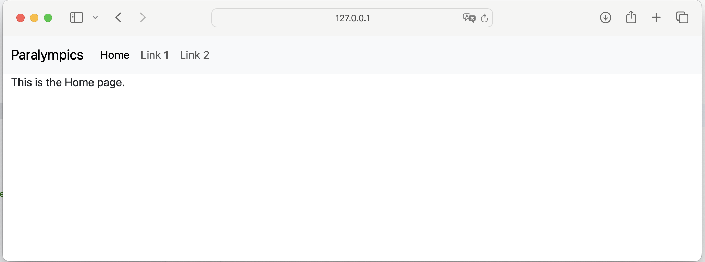

# Flask version of the activities

The Flask application is based on the paralympics application that you created for the REST API, however the Marshmallpw
schemas and REST API routes have been removed. The application code should otherwise be as you saw at the end of week 4.

In this activity you will:

- Create a Flask page template using HTML only
- Add styling to an HTML template using Bootstrap CSS
- Adapt the HTML and CSS to support responsive styling
- Use Jina to create parent/child templates for a Flask application

## Check the Flask app runs

Check that the app runs before starting any of the activities.

1. `flask --app paralympics_flask run --debug`

   You may need to change the port number if you already have something running on the default port 5000
   e.g. `flask --app paralympics_flask run --debug --port=5050`.
2. Go to the URL that is shown in the terminal. By default, this is http://127.0.0.1:5000
3. Stop the app using `CTRL+C`

## Create a page using HTML

### HTML basics

The basic tag structure for HTML is `<start_tag> some content </end_tag>`. This set of opening tag + content + closing
tag is referred to as an **HTML element**.

A small number of elements only have an opening tag e.g. ``, `<br>`, `<hr>`. There is a list of
these [void elements here](https://developer.mozilla.org/en-US/docs/Glossary/Void_element).

Elements can also have attributes that give additional information. In this course you will mostly use id
e.g. `id="some-name"` and class e.g. `class="some-class"`. `id` is used to locate a particular element on a webpage,
and `class` is used in adding styles to elements (more on these in later sections).

HTML documents start with a document type declaration `<!DOCTYPE html>`. This is required at the start of the document.

The HTML document itself begins with `<html>` and ends with `</html>`

The part that is mostly not visible in the final webpage is between `<head>` and `</head>`. This is typically metadata,
i.e. info about the page.

The part of the HTML document that is visible in the browser is between `<body>` and `</body>`.

A minimal page structure looks like the following:

```html
<!DOCTYPE html>
<!-- This is an HTML comment, you won't see it on the page -->
<!-- Head section -->
<html lang="en">
<head>
    <meta charset="utf-8">
    <title>COMP0034 Introduction to HTML - Basic page structure</title>
</head>
<!-- Body section -->
<body>
<p>Here is some text on a page.</p>
</body>
</html>
```

You can practice using HTML with the optional activity [2-html-intro.md](2-html_intro.md).

### How Flask uses HTML

Flask returns pages from a route using the `render_template` function.

This function takes an HTML template as a parameter.

By default, Flask looks for templates in a folder named `templates` in the application package.

### Activity: change the Flask index() route to display a page from an HTML template

1. Find the [templates folder](../src/paralympics_flask/templates) in the Flask application.
2. Find and open [index.html](../src/paralympics_flask/templates/index.html).
3. Add enough HTML to create a basic page. Have a look at the code above.
4. Add a paragraph tag in the body that says 'Welcome to HTML!'
   e.g. `<p>Welcome to HTML!</p>`.
5. You will need to add `from flask import render_template` to the imports section
   of `views.py`.
6. Modify the `index()` route in `views.py` to `return render_template('index.html')` in
   place of the current text.
7. Run the app e.g. `flask --app paralympics_flask run --debug`.
8. Go to the URL that is shown in the terminal e.g. <http://127.0.0.1:5000>
9. Check the page displays 'Welcome to HTML!' rather than 'Hello, world!'
10. Stop the app using `CTRL+C`

If you get stuck, look at the [week 7 code](https://github.com/nicholsons/comp0034-wk7/tree/master/paralympics_flask),
and find route
with `def index_html():` in `views.py`, and `index.html` in the `templates` folder.

## Apply styling using CSS

### CSS overview

CSS stands for Cascading Style Sheets. It provides styles for HTML elements.

Web browsers apply CSS rules to a document. A CSS **rule** consist of:

- A **selector**, which selects the element(s) you want to style

- A declaration which is a set of **properties** with values

The following CSS rule selects the paragraph tag `p` and makes the font colour red and the text center-aligned.

```css
p {
    color: red;
    text-align: center;
}
```

A set of these CSS rules are called a **stylesheet**.

CSS can be added to HTML elements in 3 ways:

- **Inline**: using the style attribute in HTML elements
- **Internal**: using a `<style>` element in the `<head>` section
- **External**: using an external CSS file e.g. `my_css.css`.

An **Inline style** affects one element only and is defined in the `style'=""` attribute of that HTML element
e.g. `<h1 style="color: blue; background-color: yellow;">Hello World! </h1>`. Avoid using this method as it is much
harder to maintain!

An **internal stylesheet** places CSS inside a `<style>` element contained inside the HTML `<head>` section.

```html

<head>
    <title>Internal style sheet example</title>
    <style>
        h2 {
            color: blue;
            background-color: yellow;
        }
    </style>
</head>
```

An **external CSS file** is usually the preferred method and is used in most COMP0034 example code. CSS is
written in a separate file with a `.css` extension.
The stylesheet `.css` file is referenced in the `<head>` section of the html using an HTML `<link>`
element. In this example the file `styles.css` is assumed to be in a folder named `css` which is a sub-folder to the
folder containing the html file that is using it.


```html

<head>
    <title>CSS external stylesheet example</title>
    <link rel="stylesheet" href="/css/styles.css">
</head>
```

External stylesheets may also be linked as a URL, for example, URL to the [Milligram css](https://milligram.io):

```html

<head>
    <title>CSS external stylesheet - Milligram example</title>
    <link rel="stylesheet" href="https://cdnjs.cloudflare.com/ajax/libs/milligram/1.4.1/milligram.css">
</head>
```

A little more detail is included in the optional activity [3-css-intro.md](3-css_intro.md)

### Adding an open source external CSS stylesheet in a Flask HTML template

While you can write your own CSS, **for your coursework it is recommended that you use a third party CSS**. Check it has
an open source license, i.e. that you are given permission by its author to use it. Writing your own CSS is not
considered in the mark scheme so writing your own CSS will not improve your marks.

Bootstrap is a popular CSS library that has extensive documentation and support and is used in the course materials for
this reason.

Bootstrap is widely used which some say leads to many sites looking similar, others criticisms include the fact that it
is comprehensive, leading to larger file sizes, and yet you may only want to use a small subset of its features. There
are alternatives to Bootstrap you can explore, try searching `alternatives to Bootstrap`, such as:

- [Pure.css](https://purecss.io/start/)
- [Materialize](https://materializecss.com/getting-started.html)
- [ZURB foundation](https://foundation.zurb.com/)

You can use a CDN (Content Distribution Network) version of Bootstrap, that is a version someone else hosts on their
server infrastructure. Refer to
the [Bootstrap documentation for the code you need to add](https://getbootstrap.com/docs/5.3/getting-started/introduction/#quick-start).
You need an active internet connection while your app is running to use this method. For this activity to avoid any
issues the current version (as at the time of writing) has been downloaded
from https://getbootstrap.com/docs/5.3/getting-started/download/

Flask apps have a folder named **static**. You place files that don't change while the app is running such as CSS,
JavaScript and images, in this folder. You can add sub-folders to **static**.

To reference the **static** folder in Flask, you use a Flask function `url_for` which you add using syntax for a Jinja
expression. Jinja is introduced in the next chapter, for now please just accept the above syntax. The code structure is:

```jinja
<head>
   <link rel="stylesheet" href="{{ url_for('static', filename='style.css') }}">
</head>
```

`static` is the folder name, the `filename` should include both the .css file name and any sub-folder structure below
static. For example, if in a folder `static/css/mystyles.css` you would
use: `<link rel="stylesheet" href="{{ url_for('static', filename='/css/mystyles.css') }}">`

To apply Bootstrap styles to your HTML elements, you will need to refer to
the [Bootstrap documentation](https://getbootstrap.com/docs/5.3/getting-started/introduction/) and use the left side
menu to find the aspect you are interested in. This explains the bootstrap classes to use to achieve a particular
effect,
and provides example code you can copy and adapt.

### Activity: Add Bootstrap CSS as the stylesheet to index.html

1. Open `index.html` in the `templates` folder.
2. Use the example above to work out what the `<link>` syntax should be for `bootstrap.css` within the `static/css`
   folder. Add this to the `<head>` section.
3. Use a [Boostrap style](https://getbootstrap.com/docs/5.3/content/typography/#inline-text-elements) to alter
   the `<p>Welcome to HTML!</p>` in some way, e.g. `<p class="text-decoration-underline">Welcome to HTML!</p>`
4. Run the app e.g. `flask --app paralympics_flask run --debug`.
5. Go to the URL that is shown in the terminal e.g. <http://127.0.0.1:5000>
6. Check the page displays 'Welcome to HTML!' with the changed style, and uses a different font (typeface) than
   previously.
7. Stop the app using `CTRL+C`

If you get stuck, look at the [week 7 code](https://github.com/nicholsons/comp0034-wk7/tree/master/paralympics_flask),
and find route definition for `/css` in `views.py`, and `index_css.html` in the `templates` folder.

## Adapt the HTML and CSS to create a responsive template design

### Intro to responsive design

The intent of responsive design is to make web pages look good on all devices: desktop, tablets, and phones. For
example, people are typically used to scrolling websites vertically but not horizontally. So there are techniques to
achieve responsive web design such as resize, hide, shrink, enlarge, move the content.

To create a web page that is responsive:

- Set the viewport
- Use responsive images
- Use responsive text
- Use media queries (apply a different style for different screen sizes)
- Optionally, use a grid layout

The **viewport** is the visible area inside the browser window. A `<meta>` viewport element gives the browser
instructions on how to control the page's dimensions and scaling. This gives the browser instructions on how to control
the page's dimensions and scaling. For example the following code would be placed in the `<head>` section of a html
document.

```html

<meta name="viewport" content="width=device-width, initial-scale=1">
```

- `width=device-width` sets the width of the page to follow the screen-width of the device (varies depending on the
  device).
- `initial-scale=1` sets the initial zoom level when the page is first loaded by the browser.

To use Bootstrap in a responsive way, the minimum you need is:

- Include the `<meta>` tag in the `<head>` to set the page width to the device
  `<meta name="viewport" content="width=device-width, initial-scale=1">`
- Wrap the page contents in an HTML `<DIV>` tag that has a container CSS class. Bootstrap offers two container classes:
    - `.container` class provides a responsive fixed width container
    - `.container-fluid` class provides a full width container, spanning the entire width of the viewport

The other responsive aspects to consider are briefly covered in [4-responsive_intro.md](4-responsive_intro.md).

### Activity: Update the HTML template to display the index page responsively

1. Open `index.html` in the `templates` folder.
2. In the <head> section before the style sheet
   add: `<meta name="viewport" content="width=device-width, initial-scale=1">`
3. In the <body> section add a <div> with a Bootstrap container class i.e. add `<div class='container'>` after `<body>`
   and `</div>` just before `</body>`
4. Add a large image within the `<div>` section
   using ``
5. Run the app e.g. `flask --app paralympics_flask run --debug`.
6. Go to the URL that is shown in the terminal e.g. <http://127.0.0.1:5000>
7. Alter the size of the browser window, the image should re-size.
8. Stop the app using `CTRL+C`

To see the difference with a non-responsive image, run the week 7 code and go to <http://127.0.0.1:5000/css>

If you get stuck, look at the [week 7 code](https://github.com/nicholsons/comp0034-wk7/tree/master/paralympics_flask),
and find route definition for `/responsive` in `views.py`, and `index_responsive.html` in the `templates` folder.

## Use Jinja to create templates

You may find the following references useful during this activity:

- [Jinja template designer documentation](https://jinja.palletsprojects.com/en/3.1.x/templates/)
- [Flask tutorial on templates](https://flask.palletsprojects.com/en/3.0.x/tutorial/templates/)
- [VS Code documentation on templates](https://code.visualstudio.com/docs/python/tutorial-flask#_create-multiple-templates-that-extend-a-base-template)
- [Primer on Jinja templating](https://realpython.com/primer-on-jinja-templating/)

### Overview of Jinja

Jinja is a template engine. You commonly use template engines for web page templates that receive dynamic content from
the back end (in this case the Flask application) and render it as a static page in the front end (web browser).

Jinja allows you to add elements to your page that will be generated from Python code.

Jinja templates can be HTML files that have Jinja syntax in places. The types of Jinja syntax you may want to use are:

- ``  for statements such as 'block' and 'extend'; control structures 'for' and 'if'; and macros.
- `{{ ... }}` for expressions and variables
- `{# ... #}` for comments

[Macros](https://jinja.palletsprojects.com/en/3.1.x/templates/#macros) can be used to write reusable functions.

Some examples of common statements:

```jinja
{# To inherit all the layout from another template, in this case 'layout.html' #}
 

{# To define an area, a 'block', in a template where the content will be dynamically provided for each page created from the template #}
 
    {# Here is where the dynamic contents will appear #}


{# For #}
 
	<p>{{ user.username|e }}</p> 

```

Jinja provides template inheritance. "Template inheritance allows you to build a base “skeleton” template that contains
all the common elements of your site and defines blocks that child templates can override." In practical terms, in your
Flask app you will create a parent template that contains the default HTML page structure, the CSS, etc. and then child
templates inherit this and apply any specific changes for certain type of page. If you then need to change the overall
structure (e.g. a menu/nav bar) or a CSS stylesheet, you only need to do so in one place in the parent template.

While security concerns have not yet been addressed in this course, you might want to be aware that "In Flask, Jinja is
configured to autoescape any data that is rendered in HTML templates. This means that it’s safe to render user input;
any characters they’ve entered that could mess with the HTML, such as < and > will be escaped with safe values that look
the same in the browser but don’t cause unwanted effects.". This will be important if you plan to allow users to input
text in some way in your application as it prevents them entering HTML script that could harm your application.

### 1. Create a parent template for the base page layout

This layout will provide all the common elements of your web pages such as:

- the overall html structure
- links to css (and javascript) files
- defined sections that will have page specific content

You have already defined a Jinja2 variable `{{ variable }}` to use Flask `url_for` to render the path to the
CSS file.

Create and save an empty file in the templates folder called 'navbar.html'. You will edit this later.

Create a parent template in the templates folder with a meaningful filename such as 'layout.html' or 'base.html'. Add
the code below to it.

The code includes the Bootstrap CSS and denotes sections that will be provided by 'child' templates:

- a 'block' called head that will allow child templates to add to this if needed
- a 'block' called title that allows child templates to set their own page title and inherits the overall website name
- a 'include' that uses the contents of navbar.html to generate a navbar
- a 'block' called content that will have the main page contents

You can add as many 'block' elements as you wish with any meaningful names to identify them.

This code has extra indents included to help you see the structure of the code. Your IDE is likely to remove
these indents!

```jinja2
<!DOCTYPE html>
<html lang="en">
    <head>
        
            <meta charset="utf-8">
            <meta name="viewport" content="width=device-width, initial-scale=1">
            <link rel="stylesheet" href="{{ url_for('static', filename='css/bootstrap.css') }}">
            <title>Paralympics - </title>
        
    </head>
    <body>
        <header>
            
        </header>
        <div id="content" class="container-fluid">
            
        </div>
    </body>
</html>
```

### 2. Add Bootstrap navbar code to navbar.html

Create a basic Bootstrap navbar and save the code to a template called `navbar.html`. This is not a full HTML page, it
contains just the HTML needed for
a [Bootstrap styled navigation bar](https://getbootstrap.com/docs/5.3/components/navbar/).

The code for the homepage link uses Jinja syntax to use the flask `url_for()` function to generate the link to the home
page of our app. The homepage route, '/', has the function name of 'index' in 'views.py'.

Links 1 and 2 do not currently have any pages to link to so will remain on the same page when clicked as denoted by
the '#' symbol.

```html

<nav class="navbar navbar-expand-lg bg-body-tertiary">
    <div class="container-fluid">
        <a class="navbar-brand" href="#">Paralympics</a>
        <button class="navbar-toggler" type="button" data-bs-toggle="collapse" data-bs-target="#navbarSupportedContent"
                aria-controls="navbarSupportedContent" aria-expanded="false" aria-label="Toggle navigation">
            <span class="navbar-toggler-icon"></span>
        </button>
        <div class="collapse navbar-collapse" id="navbarSupportedContent">
            <ul class="navbar-nav me-auto mb-2 mb-lg-0">
                <li class="nav-item">
                    <a class="nav-link active" aria-current="page" href="{{ url_for('index') }}">Home</a>
                </li>
                <li class="nav-item">
                    <a class="nav-link" href="#">Link 1</a>
                </li>
                <li class="nav-item">
                    <a class="nav-link" href="#">Link 1</a>
                </li>
            </ul>
        </div>
    </div>
</nav>
```

### 3. Create (or modify) `index.html` to inherit the parent template

`index.html` inherits from `base.html` (or whatever name you saved it as) so all you need to provide is the values for
the 'blocks'.

Using `self.title()` in the [child template](https://jinja.palletsprojects.com/en/3.1.x/templates/#child-template)
allows access to a variable defined in a block elsewhere on the page.

```jinja2


Home


    <p>This is the {{ self.title() }} page.</p>

```

### 4. Check the route in views.py

Check that the index routes in views.py looks like this:

```python
from flask import render_template, current_app as app


@app.route('/')
def index():
    return render_template('index.html')
```

### 5. Run the Flask app
Run the Flask app e.g. `flask --app paralympics_flask run --debug`

Depending on whether you changed any of the HTML, it should look something like this:



Congratulations on making it to the end of this week's activities!