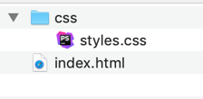
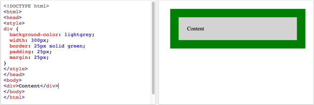
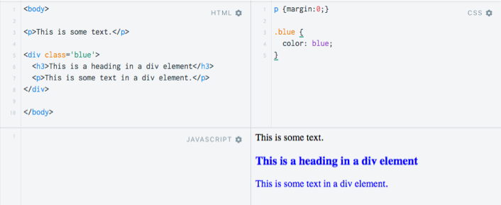

# Introduction to CSS

## What is CSS?

CSS stands for Cascading Style Sheets.

CSS provides styles for HTML elements.

Examples of CSS:

```css
body {
    background-color: lightblue;
}

h1 {
    color: navy;
    margin-left: 20px;
}
```

Web browsers apply CSS rules to a document.

A CSS **rule** consist of:

- A **selector**, which selects the element(s) you want to style

- A declaration which is a set of **properties** with values

The following CSS rule selects the paragraph tag `p` and makes the font colour red and the text center-aligned.

```css
p {
  color: red;
  text-align: center;
}
```

A set of these CSS rules are called a **stylesheet**.

## How to add CSS styles to HTML

CSS can be added to HTML elements in 3 ways:

- **Inline**: using the style attribute in HTML elements
- **Internal**: using a `<style>` element in the `<head>` section
- **External**: using an external CSS file e.g. `my_css.css`.

Inline styles affect one element only and are contained within a ’style’ attribute. Avoid using this method as it is
much harder to maintain!

```html
<!DOCTYPE html>
<html lang="en">
<head>
    <title>CSS inline example</title>
</head>
<body>
<h1 style="color: blue; background-color: yellow;">Hello World! </h1>
<p style="color:red;">CSS inline example</p>
</body>
</html>
```

An **internal stylesheet** places CSS inside a `<style>` element, contained inside the HTML `<head>`.

```html
<!DOCTYPE html>
<html lang="en">
<head>
    <title>Internal style sheet example</title>
    <style>
        h2 {
            color: blue;
            background-color: yellow;
        }
    </style>
</head>
<body>
<h1>Hello World! </h1>
</body>
</html>
```

Using an **external CSS file** is usually the preferred method and is what we will use mostly in COMP0034. CSS is written in a separate file with a `.css`
extension. The stylesheet is referenced in the `<head>` section of the html as `.css` file using an HTML `<link>`
element. In this example the file `styles.css` is assumed to be in a folder named `css` which is a sub-folder to the
folder containing the html file that is using it.



```html

<head>
    <title>CSS external stylesheet example</title>
    <link rel="stylesheet" href="/css/styles.css">
</head>
```

External stylesheets may also be linked as a URL, for example, URL to the ‘bootstrap’ css (bootstrap is a web
development framework):

```html

<head>
    <title>CSS external stylesheet - Bootstrap example</title>
    <link href="https://cdn.jsdelivr.net/npm/bootstrap@5.1.3/dist/css/bootstrap.min.css" rel="stylesheet"
          integrity="sha384-1BmE4kWBq78iYhFldvKuhfTAU6auU8tT94WrHftjDbrCEXSU1oBoqyl2QvZ6jIW3" crossorigin="anonymous">
</head>
```

## Precedence of styles

When there are more than one styles for an element then all the styles in a page will "cascade" into a new "virtual" style sheet using the following general rules, where number one has the highest priority:

1. Inline style (inside an HTML element)
2. External and internal style sheets (in the head section)
3. Browser default

[Specificity](https://www.w3schools.com/css/css_specificity.asp) is calculated to define which style takes precedence where two or more apply to the same element.

Use browser developer tools to help you identify which style is being applied.

## CSS selectors

Examples to date have shown a style applied to a particular type of HTML element, there are other ways to select the content to style

| Selector | Example    | Description                             |
|:---------|:-----------|:----------------------------------------|
| .class   | .intro     | Selects all elements with class="intro" |
| #id      | #firstname | Selects the element with id="firstname" |

General guidance for using selectors:

| Selector | Syntax                        | Use                                                                                                                                                                                                  |
|:---------|:------------------------------|:-----------------------------------------------------------------------------------------------------------------------------------------------------------------------------------------------------|
| Element  | element { css declarations; } | Use when all or most instances of an HTML element are to be styled in the same way                                                                                                                   |
| Class    | .class { css declarations;}   | Use to select elements that are more specific. The class name is the selector (not the element), so the style can be applied to any element. The same class can be used one or more times on a page. |
| ID       | #id { css declarations;}      | Must be unique so they can only be used once per page                                                                                                                                                |

## CSS box model

The CSS box model is essentially a box that wraps around every HTML element. It consists of:

- **Content** The content of the box, where text and images appear
- **Padding** Clears an area around the content. The padding is transparent
- **Border** A border that goes around the padding and content
- **Margin** Clears an area outside the border. The margin is transparent



## CSS and the HTML `<div>` tag

HTML `<div></div>` tag divides content into sections. CSS styling can then be applied to sections.



You will see the `<div>` tag used in a much of the teaching and reference materials used in COMP0034.
