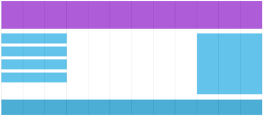

# Introduction to responsive design using CSS and HTML

The intent is to make web pages look good on all devices: desktop, tablets, and phones. Generally, people are used to
scrolling websites vertically but not horizontally. So there are techniques to achieve responsive web design such as
resize, hide, shrink, enlarge, move the content.

To create a web page that is responsive:

- Set the viewport
- Use responsive images
- Use responsive text
- Use media queries (different style for different screens)
- Optionally, use a grid layout

The **viewport** is the visible area inside the browser window. A `<meta>` viewport element gives the browser
instructions on how to control the page's dimensions and scaling. This gives the browser instructions on how to control
the page's dimensions and scaling. For example the following code would be placed in the `<head>` section of a html
document.

```html

<meta name="viewport" content="width=device-width, initial-scale=1">
```

- `width=device-width` sets the width of the page to follow the screen-width of the device (varies depending on the
  device).
- `initial-scale=1` sets the initial zoom level when the page is first loaded by the browser.

**Responsive images** scale nicely to fit any browser size.

If the CSS width property is set to 100%, the image will be responsive and scale up and down.

If the max-width property is set to 100%, the image will scale down if it has to, but never scale up to be larger than
its original size.

The`srcset` attribute can be to define more than one image i.e. to specify different images for different width views.

[Mozilla's guide to responsive images](https://developer.mozilla.org/en-US/docs/Learn/HTML/Multimedia_and_embedding/Responsive_images)

```html

```

To achieve **responsive text** or typography use viewport units for size instead of em or px. Viewport units are
relative to the viewport dimensions (width or height) of a device.

| Unit | Example  | Result                                                     |
|:-----|:---------|:-----------------------------------------------------------|
| vw   | 10vw     | 10% of the viewport's width                                |
| vh   | 5vh      | 5% of the viewport's height                                |
| vmin | 50 vmin  | 50% of the viewport's smaller dimension (height vs. width) |
| vmax | 100 vmax | 100% of the viewport's bigger dimension (height vs. width) |

**Media query** is a CSS technique. It uses the `@media` rule to include a block of CSS properties only if a certain
condition is true.

The following code is from [Mozilla](https://developer.mozilla.org/en-US/docs/Web/CSS/@media).

```css
/* At the top level of your code */
@media screen and (min-width: 900px) {
    article {
        padding: 1rem 3rem;
    }
}

/* Nested within another conditional at-rule */
@supports (display: flex) {
    @media screen and (min-width: 900px) {
        article {
            display: flex;
        }
    }
}
```

A **grid view** divides a page into columns. Elements are placed on the page spanning one or more columns. The following
example of grid-view has 12 columns.



While a grid isn't specifically a responsive technique; it provides a more flexible way of definining a page layout than
a table for example, and this flexibility can be used to support more dynamic layouts to suit different devices.

[Mozilla guide to CSS Grid Layout](https://developer.mozilla.org/en-US/docs/Web/CSS/CSS_Grid_Layout)

## Bootstrap and other third party CSS

Bootstrap is a front-end framework for web development. It has a collection of CSS classes that add pre-defined styles
to your website. It gives the ability for you to more easily create responsive designs since their CSS has been written
to support this. As well as colours/themes, also includes structural tools and ready made components. Some of which
require JavaScript plugins.

You can use much of the CSS without requiring JavaScript. You may not need Popper and JQuery, some Bootstrap features
need these. You can either download and include Bootstrap CSS in your project or you can use a hosted version e.g.
Bootstrap CDN or download the files you need and place them in your project folder structure.

```html

<head>
    <!-- Hosted version of Bootstrap-->
    <link rel="stylesheet" href="https://stackpath.bootstrapcdn.com/bootstrap/4.1.3/css/bootstrap.min.css"
          integrity="sha384-MCw98/SFnGE8fJT3GXwEOngsV7Zt27NXFoaoApmYm81iuXoPkFOJwJ8ERdknLPMO" crossorigin="anonymous">
    <!-- Bootstrap saved on the same web server -->
    <link rel="stylesheet" href="css/bootstrap.css">
</head>

```

To create a simple page using Bootstrap:

- Include doctype for HTML5 `<!DOCTYPE html>`
- Include the `<meta>` tag in the `<head>` to set the page width to the device
  `<meta name="viewport" content="width=device-width, initial-scale=1">`
- Wrap the page contents in a container. There are two container classes to choose from:
  - `.container` class provides a responsive fixed width container
  - `.container-fluid` class provides a full width container, spanning the entire width of the viewport e.g.

      ```html
          <div class="container-fluid">
          <h1>Hello, world!</h1></div>```

Bootstrap can be used with a grid system. Bootstrap is no longer restricted to 12
columns. The grid system is not covered in the teaching materials for COMP0034 though you are welcome to use it in your coursework.

There are lots of freely available templates and examples that use Bootstrap.
See [Bootstrap documentation](http://getbootstrap.com/docs).

Bootstrap is widely used which some say leads to many sites looking similar, others criticisms include the fact that it
is comprehensive and yet you may only want to use a small subset of its features. While writing your own css may take
time, there are alternatives to Bootstrap you can explore such as:

- [Pure.css](https://purecss.io/start/)
- [Materialize](https://materializecss.com/getting-started.html)
- [Flexbox Grid](http://flexboxgrid.com/)
- [HTML Kickstart](http://www.99lime.com/elements/)
- [ZURB foundation](https://foundation.zurb.com/)

## COMP0034 Coursework

**For your coursework it is recommended that you use a third party CSS** (check it has an open source license, ie that you
are allowed to use it). CSS is not considered in the marking scheme so there is no value in writing your own.

## Links

- [w3schools responsive design](https://www.w3schools.com/css/css_rwd_intro.asp)
- [Mozilla responsive design](https://developer.mozilla.org/en-US/docs/Learn/CSS/CSS_layout/Responsive_Design)
