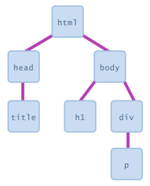

# Introduction to JavaScript

You will not write or edit any JavaScript in COMP0034. This activity is included for those who wish to understand a little about how it works.

## What is JavaScript and what is it used for?

JavaScript is a scripting language used widely in web pages. Mozilla defines it as "JavaScript is a scripting or
programming language that allows you to implement complex features on web pages — every time a web page does more than
just sit there and display static information for you to look at — displaying timely content updates, interactive maps,
animated 2D/3D graphics, scrolling video jukeboxes, etc. — you can bet that JavaScript is probably involved. It is the
third layer of the layer cake of standard web technologies, along with HTML and CSS."

Unlike Python, which requires a Python environment to run and in our apps we will run on the server; JavaScripts runs in
the browser of the device that is being used to access the web page (unless the person has purposely disabled
JavaScript). This execution of code on the device is referred to as 'client-side'.

Examples of the use of JavaScript include:

- Store values inside variables.
- Operations on "strings".
- Running code in response to certain events occurring on a web page e.g. code that is run when a button is 'clicked'.

We will not explicitly write any JavaScript in this course however you should be aware that it exists and what it does.

We will use Plotly Dash with Python. Plotly Dash will 'translate' some of our Python code to JavaScript. The Bootstrap
library also uses JavaScript for some of its components.

## How can JavaScript be added to a web page?

JavaScript is applied to an HTML page in a similar way as to CSS.

JavaScript uses the `<script>` element. It can be included either within the HTML ('internal') or in a separate
JavaScript file ('external').

### Internal Javascript

Using this method is considered bad practice as it is mixing HTML and JavaScript code which can make it harder to
maintain. However, try the
following [example from Mozilla](https://developer.mozilla.org/en-US/docs/Learn/JavaScript/First_steps/What_is_JavaScript#inline_javascript_handlers)
so you can see how it works.

This is in the `js_intro.html` file.

```html
<!DOCTYPE html>
<html lang="en">
<head>
    <meta charset="utf-8">
    <meta name="viewport" content="width=device-width, initial-scale=1">
    <!-- Bootstrap CSS -->
    <link href="https://cdn.jsdelivr.net/npm/bootstrap@5.1.3/dist/css/bootstrap.min.css" rel="stylesheet"
          integrity="sha384-1BmE4kWBq78iYhFldvKuhfTAU6auU8tT94WrHftjDbrCEXSU1oBoqyl2QvZ6jIW3" crossorigin="anonymous">
    <title>JavaScript examples</title>
</head>
<body>
<div class="container">
    <br>
    <p>This page uses Bootstrap styling and contains examples of JavaScript.</p>
    <h1>Internal JavaScript</h1>
    <script>
        function createParagraph() {
            const para = document.createElement('p');
            para.textContent = 'You clicked the button!';
            document.body.appendChild(para);
        }
    </script>
    <button onclick="createParagraph()" type="button" class="btn btn-primary">Click me!</button>
</div>
</body>
</html>
```

### External JavaScript

The second and preferred method is to include JavaScript in a separate file. Create a file in your IDE with the
extension `.js`.

```html

<script src="js_intro.js" defer></script>
```

`js_intro.js`

```javascript
function createParagraph() {
    let head_ext = document.querySelector('#external-js-heading')
    let p = document.createElement('p');
    p.innerHTML = 'You clicked the button!';
    head_ext.append(p);
}
```

## When is JavaScript executed?

The JavaScript is executed when the browser sees it so location is important. If you place JavaScript in the `<head>`
that attempts to edit content in the `<body>` you are likely to see an error as the JavaScript in the head will be
executed before the body has loaded and so the page content to be edited isn’t yet available.

Best practice was (is?) to load external .js files at the end of the HTML just before the closing `</body>` tag.
Alternatively you can specify how the external JavaScript file is loaded using the script tag with the `defer`
or `asynch` parameters e.g.

```html
<!-- Executed when the page has finished parsing -->
<script src=“myjs.js” defer></script>
<!-- Executed asynchronously, after the HTML parsing is complete -->
<script src=“myjs.js” asynch></script> 
```

## Event listener/handlers

JavaScript functions can be set as event listeners and handlers, i.e. when you interact with the element, the function
will execute.

The following example would call the onclick event when a button is clicked:

HTML

```html
<button id="b2">Click me!</button>
```

JavaScript

```javascript
document.querySelector("#b2").addEventListener("click", function () {
        alert("You clicked the button!");
    }
);
```

## DOM and JavaScript selectors

The Document Object Model (DOM)  connects web pages to scripts or programming languages. The DOM is an object-oriented
representation of a web page. The DOM model represents a document (e.g. web page) with a logical tree where:

- each branch ends in a node
- each node contains objects



JavaScript code can access these objects to:

- examine an elements' state e.g. see whether a box is checked
- change state e.g. insert some new text into a `div`
- change styles e.g. make a paragraph red

JavaScript does this by selecting elements using the element type, a class or its id.

```javascript
// Get the element in the document with id="example":
document.querySelector("#example");
// Get the first <p> element in the document with class="example":
document.querySelector("p.example");
// Get the first <p> element in the document:
document.querySelector("p"); 
// Get all <p> elements in the document
var x = document.querySelectorAll("p");
```

You can then make changes to the element, or elements, selected:

```javascript
// Set the background color of the first <p> element
x[0].style.backgroundColor = "red";  
// Get the element with the id demo and set the text to 'Hello World'
document.querySelector("#demo").innerHTML = "Hello World!";
```

## Further information

[Mozilla JavaScript reference](https://developer.mozilla.org/en-US/docs/Web/JavaScript)
